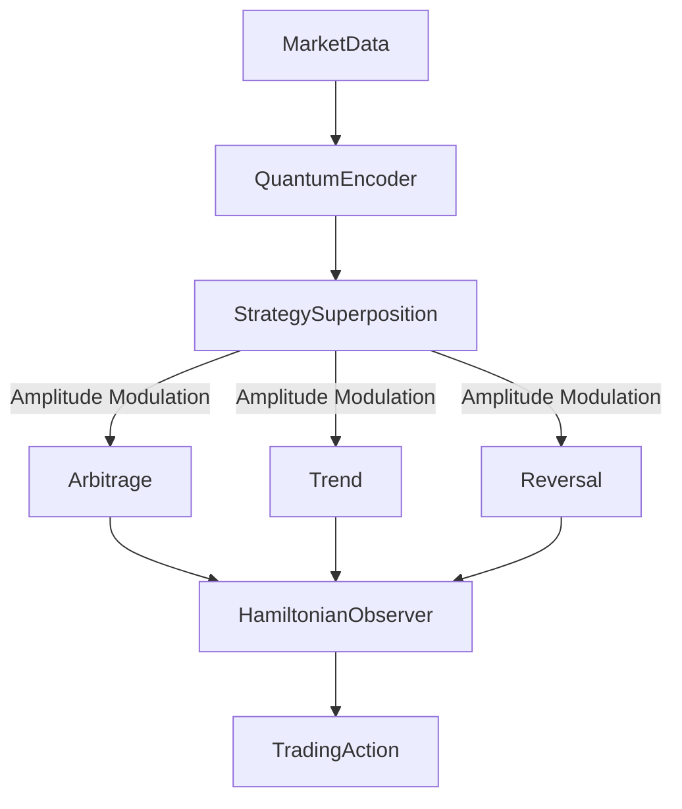

# Oanda Trading Bot with Quantum Strategy Layer

## Project Overview
An algorithmic trading system integrating quantum-inspired strategies with reinforcement learning for Forex markets. The system connects to Oanda's API for real-time trading and historical data.

## Core Features
- **Quantum Strategy Layer**: Implements quantum state superposition of multiple trading strategies
- **Enhanced Reward Mechanism**: Risk-adjusted rewards with volatility scaling
- **Universal Trading Environment**: Multi-currency portfolio management with margin buffer
- **Real-time Monitoring**: Shared data manager for performance tracking

## Architecture


## Installation
```bash
# Clone repository
git clone https://github.com/yourusername/Oanda_Trading_Bot.git

# Install dependencies
pip install -r requirements.txt

# Set environment variables
cp .env.example .env
nano .env  # Add your OANDA_API_KEY
```

## Usage
```bash
# Start training
python src/trainer/universal_trainer.py

# Launch monitoring dashboard
./launch_full_system.bat
```

## Configuration
Modify `src/common/config.py` for:
- Risk parameters
- Reward function weights
- Trading session settings