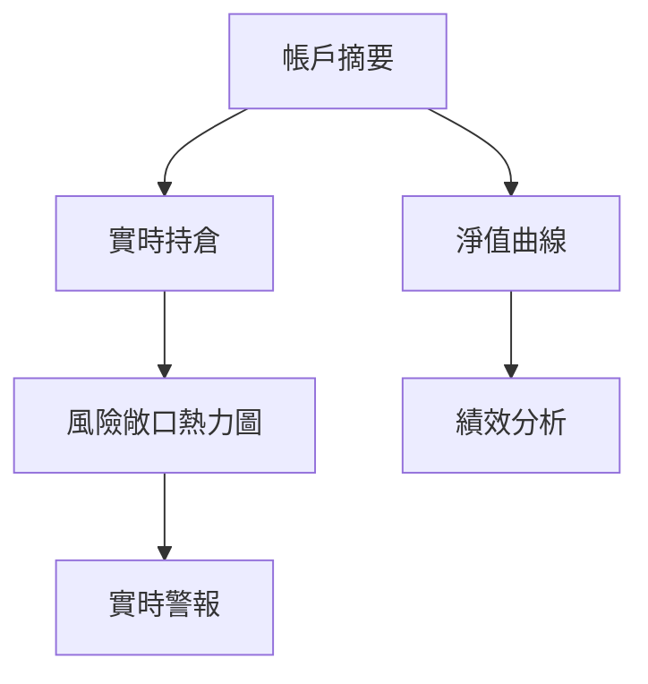

# Oanda交易系統UI重構實施計劃

## 核心功能升級

### 1. 多品種圖表系統
```python
# app.py
tabs = st.tabs([f"📊 {s}" for s in selected_symbols])
for i, symbol in enumerate(selected_symbols):
    with tabs[i]:
        # 獲取K線數據
        candles = oanda_client.get_candles(symbol, count=100, granularity="M15")
        # 生成技術圖表
        fig = generate_candlestick_chart(candles, symbol)
        st.plotly_chart(fig, use_container_width=True)
        
        # 技術指標控制
        with st.expander("技術指標設置"):
            col1, col2 = st.columns(2)
            with col1:
                show_macd = st.checkbox("顯示MACD", True)
            with col2:
                show_rsi = st.checkbox("顯示RSI", True)
```

### 2. 風險管理系統升級
```python
# app.py (側邊欄)
with st.sidebar.expander("▣ 風險管理參數", expanded=True):
    col1, col2 = st.columns(2)
    with col1:
        per_trade_risk = st.slider("單筆風險(%)", 0.1, 5.0, 1.0, step=0.1)
        total_exposure = st.slider("總風險(%)", 1.0, 30.0, 10.0, step=0.5) 
    with col2:
        atr_multiplier = st.slider("ATR止損倍數", 1.0, 5.0, 2.0, step=0.1)
        st.metric("最大持倉量", f"{calculate_position_size()}單位")
        
    # 風險可視化
    st.progress(calculate_risk_level())
    st.caption(f"當前風險等級: {get_risk_category()}")
```

### 3. 動態模型選擇流程
```python
# app.py
# 根據品種數量過濾模型
num_selected = len(selected_symbols)
available_models = [
    f for f in os.listdir("weights") 
    if f.startswith("model_") and int(f.split("_")[1]) >= num_selected
]

selected_model = st.selectbox(
    "選擇交易模型",
    options=available_models,
    index=0,
    help="根據選擇的品種數量動態過濾可用模型"
)
```

### 4. 專業級監控面板


## 實施步驟

### 階段1：基礎架構重構
1. 創建 `ui_components/` 目錄
   - `charting.py` - K線圖表生成
   - `risk_panel.py` - 風險管理組件
   - `alerts.py` - 警報系統

2. 修改 `app.py` 主結構：
```python
# 新架構
import ui_components.charting as charting
import ui_components.risk_panel as risk_panel

def run_app():
    # 頂部狀態欄
    render_top_bar()
    
    # 側邊控制面板
    with st.sidebar:
        render_symbol_selector()
        render_risk_controls()
        render_model_selector()
        
    # 主儀表板
    tab1, tab2, tab3 = st.tabs(["交易圖表", "風險分析", "警報中心"])
    
    with tab1:
        charting.render_charts(selected_symbols)
        
    with tab2:
        risk_panel.render_exposure_heatmap()
        risk_panel.render_equity_curve()
        
    with tab3:
        alerts.render_active_alerts()
```

### 階段2：Oanda API集成
擴展 `oanda_client.py`：
```python
# oanda_client.py
def get_equity_history(self, period="30D"):
    """獲取帳戶淨值歷史"""
    params = {"period": period}
    endpoint = accounts.AccountChanges(self.account_id, params=params)
    return self._request(endpoint)

def get_real_time_positions(self):
    """獲取實時持倉數據"""
    endpoint = positions.OpenPositions(accountID=self.account_id)
    return self._request(endpoint)
```

### 階段3：響應式設計
添加 `ui/theme.py`：
```python
# theme.py
def apply_responsive_design():
    st.markdown("""
    <style>
        @media (max-width: 768px) {
            .sidebar .sidebar-content {
                width: 95vw !important;
            }
            .main .block-container {
                padding: 1rem !important;
            }
        }
    </style>
    """, unsafe_allow_html=True)
```

## 測試計劃
1. 品種選擇壓力測試（1-20個品種）
2. 風險參數邊界測試
3. 移動端適配驗證
4. 交易流程端到端測試

## 兼容性保障
1. 創建 `legacy_support.py` 處理舊配置
2. 使用功能標記逐步啟用新功能：
```python
# config.py
ENABLE_NEW_UI = os.getenv("NEW_UI_ENABLED", "false").lower() == "true"
```

預計完成時間：2025-06-30