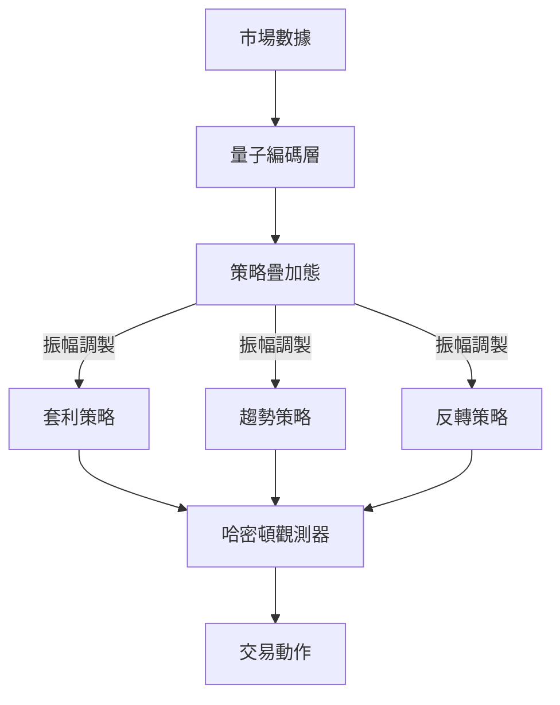

# 量子策略交易機器人

## 專案概述
整合量子啟發式策略的算法交易系統，專注於外匯市場自動交易。系統連接Oanda API獲取實時行情與歷史數據。

## 核心功能
- **量子策略層**：實現多策略量子態疊加機制
- **強化獎勵機制**：動態風險調整與波動率懲罰
- **通用交易環境**：多幣種組合管理與保證金緩衝
- **實時監控系統**：共享數據管理器追蹤交易表現

## 架構圖解


## 安裝指南
```bash
# 克隆倉庫
git clone https://github.com/yourusername/Oanda_Trading_Bot.git

# 安裝依賴套件
pip install -r requirements.txt

# 設定環境變量
cp .env.example .env
nano .env  # 填入您的OANDA_API_KEY
```

## 使用說明
```bash
# 啟動訓練程序
python src/trainer/universal_trainer.py

# 開啟監控儀表板
./啟動完整監控系統.bat
```

## 配置設定
修改 `src/common/config.py` 可調整：
- 風險參數
- 獎勵函數權重
- 交易時段設置