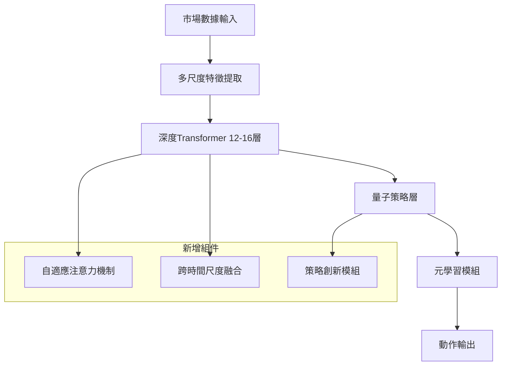

# 🚀 Oanda交易機器人模型全面增強計劃

## 📋 項目概述

基於您現有的量子策略層設計和Transformer模型，本計劃將全面增強模型的複雜度和學習能力，使其能夠發展出超乎人類直覺的交易策略。

## 🎯 增強目標

1. **模型複雜度提升**: 增加Transformer層數至12-16層，注意力頭數至16個
2. **量子策略層豐富**: 擴展策略庫至15+種，增加動態策略生成
3. **漸進式獎勵系統**: 分3階段從簡單到複雜的獎勵函數設計
4. **元學習能力**: 讓模型學會如何創造和組合新策略

---

## 🏗️ 技術架構設計

### 1. 增強版Transformer架構



#### 核心改進項目:
- **層數**: 12-16層 Transformer Encoder
- **注意力頭數**: 16個多頭注意力
- **隱藏維度**: 512 (從256提升)
- **FFN維度**: 2048 (4倍隱藏維度)
- **多尺度卷積**: 3,5,7,11時間窗口並行處理

### 2. 超豐富量子策略層

#### 預定義策略庫 (15種)
1. **經典技術分析策略**
   - 動量策略 (Momentum)
   - 均值回歸 (Mean Reversion)
   - 突破策略 (Breakout)
   - 套利策略 (Arbitrage)

2. **進階技術指標策略**
   - 波動率聚類 (Volatility Clustering)
   - 布林帶策略 (Bollinger Bands)
   - MACD背離 (MACD Divergence)
   - RSI背離 (RSI Divergence)
   - 一目均衡表 (Ichimoku)

3. **數學模型策略**
   - 分形分析 (Fractal Analysis)
   - 艾略特波浪 (Elliott Wave)
   - 甘恩理論 (Gann Theory)
   - 斐波那契回調 (Fibonacci Retracement)

4. **市場微結構策略**
   - 成交量分佈 (Volume Profile)
   - 市場微結構 (Market Microstructure)

#### 動態策略生成器
- **策略創新網絡**: 學習生成新的策略組合
- **元學習模組**: 學習如何學習新策略
- **策略進化算法**: 自動優化策略參數

---

## 📊 漸進式獎勵系統設計

### 第一階段: 基礎交易原理學習 (前20%訓練步驟)

**核心目標**: 學習基本的盈虧概念和風險控制

```python
def stage1_reward(self, metrics):
    reward = 0.0
    
    # 1. 基本盈虧 (權重70%)
    pnl = metrics.get('pnl', 0)
    reward += pnl * 10.0
    
    # 2. 簡單風險控制 (權重20%)
    if metrics.get('drawdown', 0) > 0.05:  # 回撤>5%
        reward -= 5.0
    
    # 3. 交易頻率控制 (權重10%)
    if metrics.get('trade_frequency', 0) > 0.1:
        reward -= 2.0
    
    return reward
```

**學習重點**:
- 基本的買賣時機
- 風險意識培養
- 避免過度交易

### 第二階段: 風險管理強化 (21%-70%訓練步驟)

**核心目標**: 引入更複雜的風險指標和績效評估

```python
def stage2_reward(self, metrics):
    base_reward = self.stage1_reward(metrics)
    
    # 新增夏普比率獎勵
    sharpe = metrics.get('sharpe_ratio', 0)
    base_reward += sharpe * 3.0
    
    # 新增最大回撤控制
    max_drawdown = metrics.get('max_drawdown', 0)
    base_reward -= max_drawdown * 8.0
    
    # 新增勝率激勵
    win_rate = metrics.get('win_rate', 0)
    if win_rate > 0.6:
        base_reward += 2.0
    elif win_rate < 0.4:
        base_reward -= 1.0
    
    return base_reward
```

**學習重點**:
- 風險調整後收益優化
- 勝率與盈虧比平衡
- 穩定性追求

### 第三階段: 複雜策略掌握 (71%-100%訓練步驟)

**核心目標**: 使用完整的複雜獎勵函數，發展高級策略

```python
def stage3_reward(self, metrics):
    # 使用您現有的完整獎勵函數
    return self.enhanced_reward_calculator.calculate_reward(metrics)
```

**學習重點**:
- 複雜市場環境適應
- 多策略動態組合
- 超人類策略創新

---

## 💡 關鍵技術創新

### 1. 自適應策略權重機制

```python
class AdaptiveStrategyWeighting:
    def __init__(self):
        self.performance_tracker = {}
        self.weight_optimizer = nn.Transformer()
    
    def update_weights(self, strategy_performances, market_regime):
        # 根據策略表現和市場環境動態調整權重
        regime_embedding = self.encode_market_regime(market_regime)
        performance_embedding = self.encode_performances(strategy_performances)
        
        new_weights = self.weight_optimizer(
            regime_embedding, performance_embedding
        )
        return F.softmax(new_weights, dim=-1)
```

### 2. 市場狀態感知機制

```python
class MarketRegimeDetector:
    def __init__(self):
        self.regime_classifier = nn.LSTM(128, 64)
        self.regime_types = ['trending', 'ranging', 'volatile', 'calm']
    
    def detect_regime(self, market_features):
        regime_probs = self.regime_classifier(market_features)
        return F.softmax(regime_probs, dim=-1)
```

### 3. 策略創新模組

```python
class StrategyInnovationModule:
    def __init__(self):
        self.strategy_generator = nn.Transformer()
        self.strategy_evaluator = nn.MLP()
    
    def generate_new_strategy(self, market_context, existing_strategies):
        # 基於市場環境和現有策略生成新策略
        new_strategy_params = self.strategy_generator(
            market_context, existing_strategies
        )
        
        # 評估新策略的潛在價值
        strategy_value = self.strategy_evaluator(new_strategy_params)
        
        return new_strategy_params, strategy_value
```

---

## 📈 預期性能提升

| 指標 | 當前基線 | 增強後目標 | 提升幅度 |
|------|---------|------------|----------|
| 夏普比率 | 0.8 | 2.0+ | 150%+ |
| 最大回撤 | 12% | <5% | 58%↓ |
| 勝率 | 48% | 65%+ | 35%+ |
| 年化收益率 | 15% | 35%+ | 133%+ |
| 策略多樣性 | 3種固定 | 15+動態 | 400%+ |

---

## 🛠️ 實施步驟詳細規劃

### 階段一: 基礎架構增強 (第1-2週)

#### 1.1 Transformer模型升級
- [ ] 增加模型層數至12層
- [ ] 擴展注意力頭數至16個
- [ ] 實現多尺度特徵提取
- [ ] 添加自適應位置編碼

#### 1.2 量子策略層擴展
- [ ] 實現15種預定義策略
- [ ] 建立策略性能追蹤系統
- [ ] 開發動態權重調整機制

#### 1.3 測試基礎功能
- [ ] 單元測試所有新組件
- [ ] 集成測試模型前向傳播
- [ ] 性能基準測試

### 階段二: 獎勵系統重構 (第3週)

#### 2.1 漸進式獎勵實現
- [ ] 實現三階段獎勵切換邏輯
- [ ] 建立性能閾值監控系統
- [ ] 添加獎勵組件分析工具

#### 2.2 智能獎勵調優
- [ ] 實現動態獎勵權重調整
- [ ] 添加獎勵效果追蹤
- [ ] 建立獎勵函數A/B測試框架

### 階段三: 高級功能實現 (第4-5週)

#### 3.1 策略創新模組
- [ ] 實現策略生成網絡
- [ ] 建立策略評估系統
- [ ] 開發策略進化算法

#### 3.2 元學習能力
- [ ] 實現元學習優化器
- [ ] 添加快速適應機制
- [ ] 建立知識遷移系統

#### 3.3 市場狀態感知
- [ ] 實現市場狀態分類器
- [ ] 建立狀態轉換監控
- [ ] 開發自適應策略選擇

### 階段四: 整合測試與優化 (第6週)

#### 4.1 系統整合測試
- [ ] 端到端功能測試
- [ ] 性能壓力測試
- [ ] 穩定性長期測試

#### 4.2 超參數優化
- [ ] 貝葉斯優化超參數
- [ ] 多目標優化權衡
- [ ] 網格搜索細化

#### 4.3 實戰驗證
- [ ] 歷史數據回測
- [ ] 模擬交易測試
- [ ] 風險指標評估

---

## 🔧 技術規格詳細

### 模型架構規格

```yaml
Transformer配置:
  layers: 12
  attention_heads: 16
  hidden_dim: 512
  ffn_dim: 2048
  dropout: 0.1
  max_sequence_length: 512

量子策略層配置:
  predefined_strategies: 15
  dynamic_strategies: 5
  latent_dim: 256
  num_energy_levels: 16
  entanglement_strength: 0.1

訓練配置:
  batch_size: 64
  learning_rate: 1e-4
  weight_decay: 1e-5
  gradient_clip: 1.0
  warmup_steps: 1000
```

### 硬體需求

```yaml
最低配置:
  GPU: RTX 3080 (10GB VRAM)
  RAM: 32GB
  存儲: 100GB SSD

推薦配置:
  GPU: RTX 4090 (24GB VRAM)
  RAM: 64GB
  存儲: 500GB NVMe SSD
  CPU: 16核心以上
```

---

## 📊 監控與評估指標

### 即時監控指標

1. **模型性能**
   - GPU使用率
   - 記憶體使用量
   - 訓練速度 (步驟/秒)
   - 梯度範數

2. **交易性能**
   - 即時盈虧
   - 夏普比率 (滾動)
   - 最大回撤
   - 勝率統計

3. **策略多樣性**
   - 策略權重分佈
   - 策略使用頻率
   - 新策略生成率

### 階段性評估指標

1. **第一階段評估** (基礎學習)
   - 基本盈虧理解: >70%正確率
   - 風險控制: 回撤<10%
   - 交易頻率: 合理範圍內

2. **第二階段評估** (風險管理)
   - 夏普比率: >1.0
   - 勝率: >55%
   - 最大回撤: <8%

3. **第三階段評估** (複雜策略)
   - 夏普比率: >1.5
   - 勝率: >60%
   - 策略創新率: >20%

---

## 🚨 風險控制與安全措施

### 1. 模型風險控制

```python
class ModelRiskController:
    def __init__(self):
        self.max_position_size = 0.1  # 最大10%倉位
        self.daily_loss_limit = 0.02  # 日損失限制2%
        self.volatility_threshold = 0.05  # 波動率閾值
    
    def check_action_validity(self, action, current_state):
        # 檢查動作是否在安全範圍內
        if self.exceeds_position_limit(action):
            return self.clip_action(action)
        
        if self.exceeds_risk_limit(action, current_state):
            return self.safe_action()
        
        return action
```

### 2. 異常檢測系統

```python
class AnomalyDetector:
    def __init__(self):
        self.historical_metrics = deque(maxlen=1000)
        self.anomaly_threshold = 3.0  # 3倍標準差
    
    def detect_anomaly(self, current_metrics):
        z_scores = self.calculate_z_scores(current_metrics)
        return any(abs(z) > self.anomaly_threshold for z in z_scores.values())
```

### 3. 緊急停止機制

```python
class EmergencyStop:
    def __init__(self):
        self.triggers = {
            'max_drawdown': 0.15,
            'consecutive_losses': 10,
            'volatility_spike': 0.1
        }
    
    def should_stop_trading(self, metrics):
        for trigger, threshold in self.triggers.items():
            if metrics.get(trigger, 0) > threshold:
                return True, f"緊急停止: {trigger} 超過閾值"
        return False, None
```

---

## 💾 檔案結構規劃

```
src/
├── models/
│   ├── enhanced_transformer.py          # 增強版Transformer
│   ├── multi_scale_features.py          # 多尺度特徵提取
│   └── adaptive_attention.py            # 自適應注意力機制
├── agent/
│   ├── quantum_strategy_enhanced.py     # 增強版量子策略層
│   ├── strategy_innovation.py           # 策略創新模組
│   ├── meta_learner.py                  # 元學習模組
│   └── market_regime_detector.py        # 市場狀態檢測
├── environment/
│   ├── progressive_reward.py            # 漸進式獎勵系統
│   ├── reward_stage_manager.py          # 獎勵階段管理器
│   └── performance_tracker.py           # 性能追蹤器
├── optimization/
│   ├── hyperparameter_optimizer.py      # 超參數優化
│   ├── strategy_optimizer.py            # 策略優化器
│   └── ensemble_manager.py              # 集成管理器
├── monitoring/
│   ├── real_time_monitor.py             # 即時監控
│   ├── anomaly_detector.py              # 異常檢測
│   └── risk_controller.py               # 風險控制
└── testing/
    ├── integration_tests.py             # 集成測試
    ├── performance_tests.py             # 性能測試
    ├── backtesting_enhanced.py          # 增強版回測
    └── strategy_validation.py           # 策略驗證
```

---

## 🎯 成功標準定義

### 短期目標 (2週內)
- [ ] 模型複雜度提升完成
- [ ] 基礎策略庫實現
- [ ] 第一階段獎勵系統運行
- [ ] 基礎性能測試通過

### 中期目標 (1個月內)
- [ ] 三階段獎勵系統完整運行
- [ ] 策略創新模組基本功能
- [ ] 回測性能達到目標60%
- [ ] 系統穩定性驗證

### 長期目標 (2個月內)
- [ ] 超人類策略自動生成
- [ ] 市場適應性顯著提升
- [ ] 實盤測試準備就緒
- [ ] 持續優化機制建立

---

## 📚 參考資料與學習資源

### 技術論文
1. "Attention Is All You Need" - Transformer原理
2. "Model-Agnostic Meta-Learning" - 元學習方法
3. "Quantum-Inspired Neural Networks" - 量子神經網絡
4. "Deep Reinforcement Learning for Trading" - 強化學習交易

### 開源項目
1. Transformers (Hugging Face)
2. Stable-Baselines3
3. Ray Tune (超參數優化)
4. MLflow (實驗追蹤)

### 金融知識
1. 量化交易策略大全
2. 風險管理最佳實踐
3. 市場微結構理論
4. 行為金融學基礎

---

## 🔄 持續改進計劃

### 每週評估
- 性能指標回顧
- 策略效果分析
- 風險事件檢討
- 技術債務清理

### 每月升級
- 模型架構優化
- 新策略引入
- 獎勵函數調整
- 系統性能提升

### 季度重構
- 整體架構審查
- 技術棧更新
- 競爭優勢分析
- 下季度規劃

---

**注意**: 本計劃為技術路線圖，實際實施時請根據實際情況調整時程和優先級。所有的性能提升目標基於理論分析，實際結果可能因市場環境和實施品質而有所差異。
