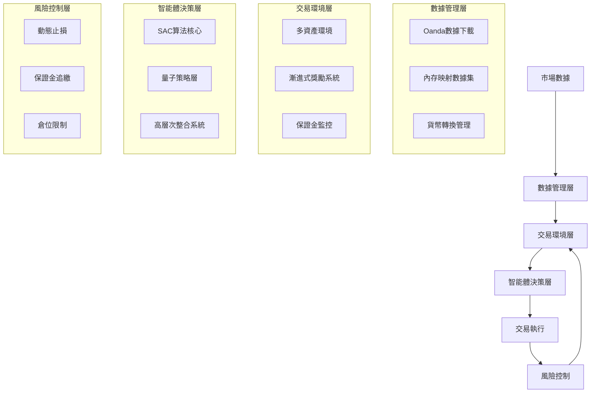

### Oanda交易機器人系統架構說明書

#### 1. 系統概述
本系統為基於強化學習的量化交易平台，整合傳統金融工程與量子計算技術，通過Oanda API實現自動化交易。系統核心包含：
- 強化學習智能體決策
- 多資產交易環境模擬
- 風險管理機制
- 三階段獎勵系統

#### 2. 核心架構


#### 3. 模組功能詳解

##### 3.1 智能體系統 (`src/agent/`)
- **SAC智能體包裝器** (`sac_agent_wrapper.py`)
  - 整合量子策略層(QuantumEnhancedTransformer)
  - 實現GPU加速訓練
  - 高層次整合系統協調：
    - 策略創新模組(StrategyInnovationModule)
    - 市場狀態感知(MarketStateAwarenessSystem)
    - 元學習優化器(MetaLearningOptimizer)

- **策略實現** (`strategies/`)
  - 機器學習策略 (ml_strategies.py)
  - 風險管理策略 (risk_management_strategies.py)
  - 統計套利策略 (statistical_arbitrage_strategies.py)

##### 3.2 交易環境 (`src/environment/`)
- **通用交易環境** (`trading_env.py`)
  - 支持20種交易品種
  - 三階段獎勵系統：
    1. 基礎收益階段
    2. 風險調整階段
    3. 策略優化階段
  - 實現Oanda精確保證金計算

- **獎勵機制** (`progressive_reward_calculator.py`)
  - 風險調整收益計算
  - 持倉時間獎勵
  - 最大回撤懲罰

##### 3.3 數據管理 (`src/data_manager/`)
- **高效數據處理**
  - 內存映射數據集(mmap_dataset.py)
  - 實時匯率轉換(currency_manager.py)
  - 品種信息管理(instrument_info_manager.py)

##### 3.4 模型系統 (`src/models/`)
- **量子增強模型**
  - 量子啟發式特徵提取
  - 多時間框架融合
  - Transformer時序處理

#### 4. 工作流程
```mermaid
sequenceDiagram
    循環 每個交易週期
        環境->>智能體: 傳送市場狀態
        智能體->>量子層: 生成交易信號
        智能體->>環境: 執行交易動作
        環境->>獎勵系統: 計算即時獎勵
        獎勵系統->>智能體: 反饋強化信號
        智能體->>策略參數: 模型更新
    end
```

#### 5. 創新技術
1. **量子策略層**
   - 量子退火優化參數
   - 振幅更新機制
2. **三階段獎勵**
   - 自適應訓練流程
   - 動態獎勵調整
3. **精確風險模擬**
   - Oanda保證金規則
   - 點差成本計算
   - 強平自動處理

#### 6. 風險管理
- **五層防護機制**：
  1. ATR波動率止損
  2. 帳戶風險百分比限制
  3. 持倉規模控制
  4. 保證金水平監控
  5. 自動強平執行

#### 7. 監控系統
- TensorBoard訓練可視化
- 實時倉位監控界面
- 詳細交易日誌記錄
- 策略表現分析報表