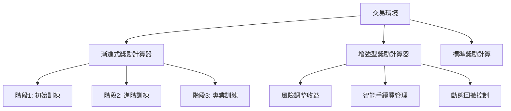

# 獎勵系統深度分析報告

## 1. 系統架構概述


## 2. 核心獎勵組件分析

### 2.1 風險調整收益 (增強型)
$$Sortino Ratio = \frac{R_p - R_f}{\sigma_d}$$
- $R_p$: 組合平均收益
- $R_f$: 無風險利率
- $\sigma_d$: 下行標準差

### 2.2 智能手續費管理
```python
def calculate_penalty():
    if profit/commission > 5 and win_rate > 0.6:
        penalty_factor = 0.3  # 高效交易低懲罰
    elif win_rate < 0.3:
        penalty_factor = 2.0  # 低效交易高懲罰
```

### 2.3 三階段漸進機制
| 階段 | 觸發條件 | 獎勵重點 |
|-----|---------|---------|
| 初始 | 期望值 < 0 | 交易頻率獎勵 |
| 進階 | 期望值 > 0 & 勝率 < 50% | 索提諾比率獎勵 |
| 專業 | 期望值 > 0 & 勝率 > 50% | Omega比率獎勵 |

## 3. 關鍵參數配置
```yaml
enhanced_reward:
  risk_adjusted_factor: 1.2
  drawdown_penalty_factor: 1.5
  trend_following_bonus: 0.5

progressive_reward:
  stage1_trade_frequency_bonus: 0.1
  stage3_kelly_bonus: 1.5
```

## 4. 改進建議

### 4.1 短期改進
- 加入RSI趨勢確認因子
```python
if rsi > 70 and position_direction > 0:
    trend_bonus *= 1.2
```

### 4.2 中期規劃
- 實現動態Kelly倉位管理
$$ f^* = \frac{bp - q}{b} $$
- $b$: 賠率
- $p$: 勝率
- $q$: 敗率 (1-p)

### 4.3 長期進化
- 跨資產相關性矩陣
- 市場情緒指數整合
- 宏觀經濟因子嵌入

## 結論
現有獎勵系統已實現多層次風險感知和階段適應性訓練，建議優先加入波動率情緒因子以提升市場狀態感知能力，逐步向跨資產組合優化方向發展。