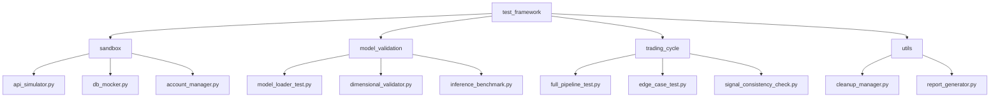

# 自动化测试框架架构

## 目录结构

## 核心模块
1. **沙盒环境初始化** (`sandbox/`)
   - `api_simulator.py`: 模拟Oanda API响应
   - `db_mocker.py`: 内存数据库实例
   - `account_manager.py`: 虚拟账户管理

2. **模型载入验证** (`model_validation/`)
   - 文件存在性检查
   - 输入/输出维度验证
   - 推理速度基准测试

3. **交易循环测试** (`trading_cycle/`)
   - 端到端流水线测试
   - 边界条件测试（空数据、极端值）
   - 信号一致性校验

4. **自动清理机制** (`utils/cleanup_manager.py`)
   - 资源释放
   - 临时文件清除
   - 数据库状态回滚